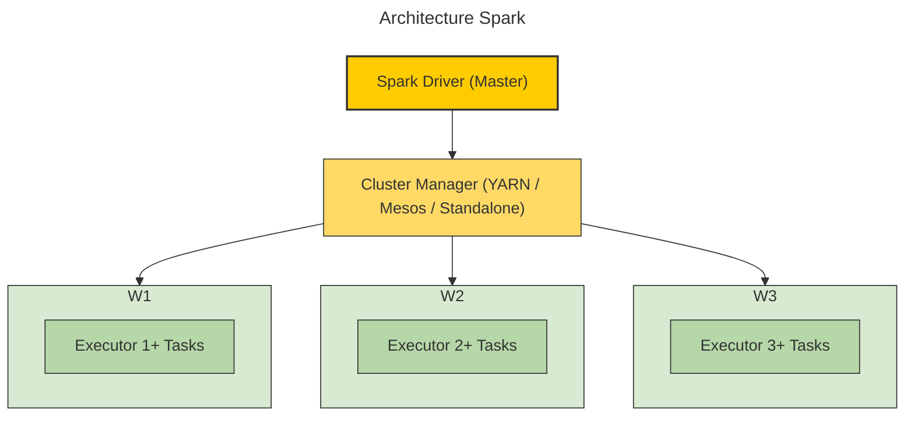

# Running Spark using Docker compose

Le principe du projet est de pouvoir faire tourner Spark sur un petit cluster constitué de quelque containers docker dans lesquels on aurait un master qui va coordonnée les noeuds worker.

---
# Spark

Spark est un framework open source qui permet de faire de l'analyse de données massives. C'est une solution beaucoup plus moderne que d'autre solutions comme **Hadoop MapReduce**.

---

## 💡Pourquoi Spark

- **Rapidité** : Spark effectue tous ses traitement en RAM au lieu d'écrire sur le disque ce qui réduit les entrées sorties et le rend beaucoup plus rapide que ses prédécesseurs. Cette structure stockant les données en ram est nommée **RDD**.
- **API simple** : Spark est à la base utilisé avec du Scala mais il également possible d'écrire du code Python, Java ou R à partir d'une api simple.
- **Traitement parallèle** : Spark effectue les tâches qu'on lui soumet en parallèles sur plusieurs worker avec un système master/worker similaire ce que peut retrouver sur Hadoop (NameNode/DataNode).

## Comment fonctionne Spark
---
**Spark** se base sur une architecture Master/Worker :
- **Driver (master)** : contient le programme principal et planifie les tâches.
- **Cluster Manager** : gère les ressources du cluster.
- **Worker** : exécute les tâches qui lui sont transmises via un executor et transmet le résultat au master.



---

# Docker

Docker est une plateforme de conteneurisation permettant de créer, déployer et exécuter des applications dans des environnements isolés appelés **conteneurs**. Chaque conteneur embarque tout le nécessaire pour exécuter l’application : code, bibliothèques, dépendances et configuration. Cela garantit un comportement identique, quel que soit l’environnement d’exécution.  

## Pourquoi utiliser Docker pour Spark

Pour un projet Spark, Docker présente plusieurs avantages :
- **Isolation** : chaque conteneur fonctionne indépendamment, ce qui évite les conflits de dépendances.
- **Portabilité** : le cluster Spark fonctionne de la même façon sur n’importe quelle machine.
- **Reproductibilité** : l’environnement est défini par un fichier (`docker-compose.yml`) garantissant que tout le monde utilise la même configuration.
- **Scalabilité** : possibilité de monter ou descendre le nombre de workers facilement avec *docker-compose up --scale*.
- **Facilité de déploiement** : Docker Compose orchestre plusieurs conteneurs (maître + workers) via un seul fichier de configuration.
## Pourquoi docker compose

Docker compose est un outil pour définir une application multi container. C'est un outil beaucoup utilisé de nos jours pour un déploiement efficace et rapide.

**Compose** simplifie le contrôle de toute l'architecture, rendant facile la gestion des services, réseaux et volumes dockers en un seul fichier sous format **YAML**.

En juste quelques commande il est possible de déployer, de stopper , et de scaler une architecture :
- **docker compose up** : déploie l'architecture.
- **docker compose down** : Stop toute une architecture.
- **docker-compose up --scale worker=5**: Pour scaler à 5 container le service master. Il est aussi possible de définir dans le **docker-compose.yml** une variable **replicas**.

```yaml title="Docker-compose avec replicas"
service:
  cache:
	image: redis:latest
	deploy:
	replicas: 2
```

