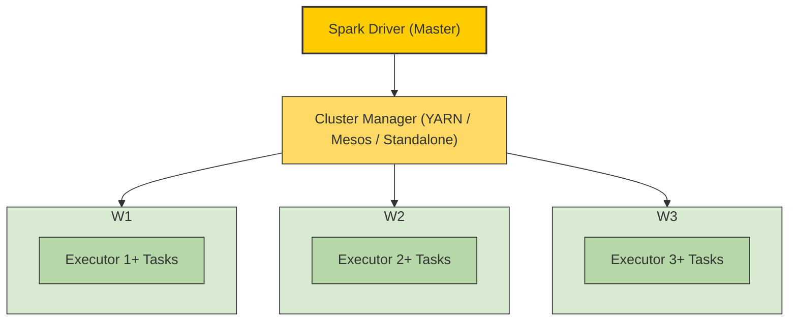

Le principe du projet est de pouvoir faire tourner Spark sur un petit cluster constitué de quelque containers docker dans lesquels on aurait un master qui va coordonnée les noeuds worker.

## Spark
---
Spark est un framework open source qui permet de faire de l'analyse de données massives. C'est une solution beaucoup plus moderne que d'autre solutions comme **Hadoop MapReduce**.

---

## 💡Pourquoi Spark

- **Rapidité** : Spark effectue tous ses traitement en RAM au lieu d'écrire sur le disque ce qui réduit les entrées sorties et le rend beaucoup plus rapide que ses prédécesseurs. Cette structure stockant les données en ram est nommée **RDD**.
- **API simple** : Spark est à la base utilisé avec du Scala mais il également possible d'écrire du code Python, Java ou R à partir d'une api simple.
- **Traitement parallèle** : Spark effectue les tâches qu'on lui soumet en parallèles sur plusieurs worker avec un système master/worker similaire ce que peut retrouver sur Hadoop (NameNode/DataNode).

## Comment fonctionne Spark
---
**Spark** se base sur une architecture Master/Worker :
- **Driver (master)** : contient le programme principal et planifie les tâches.
- **Cluster Manager** : gère les ressources du cluster.
- **Worker** : exécute les tâches qui lui sont transmises via un executor et transmet le résultat au master.

---
